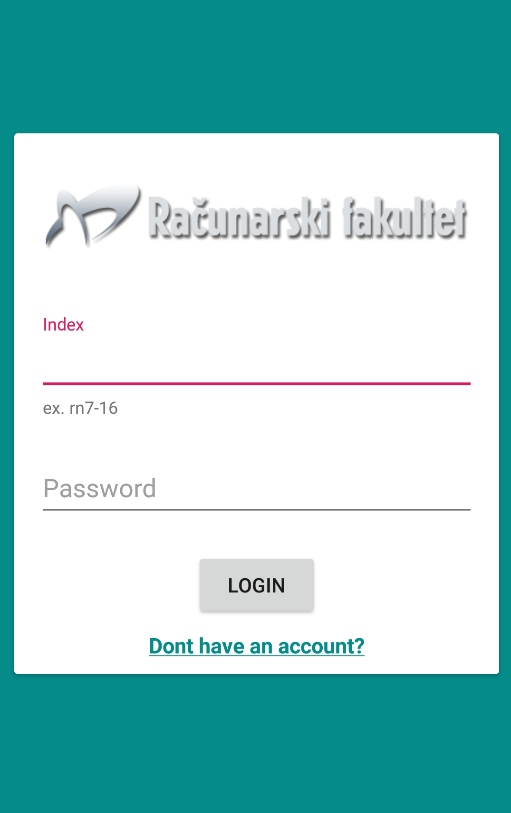
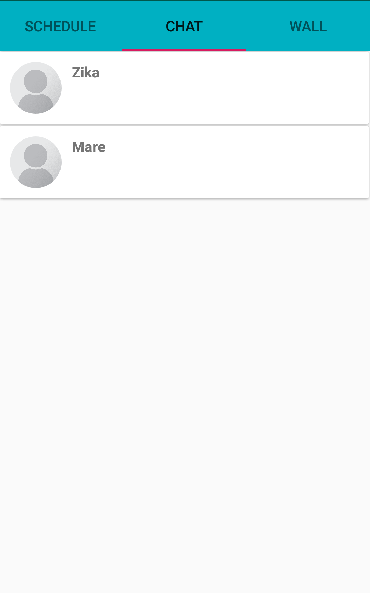
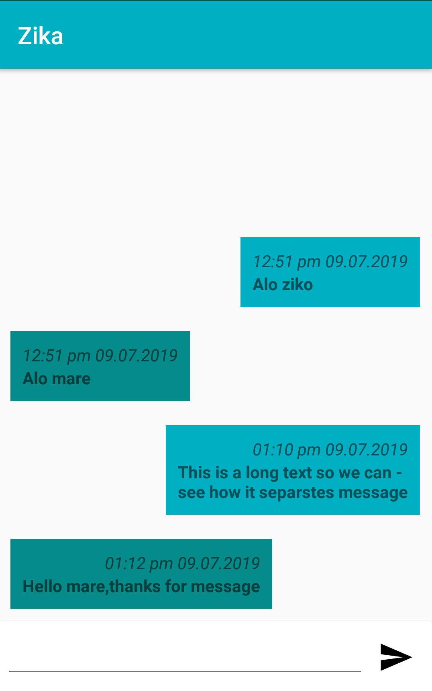
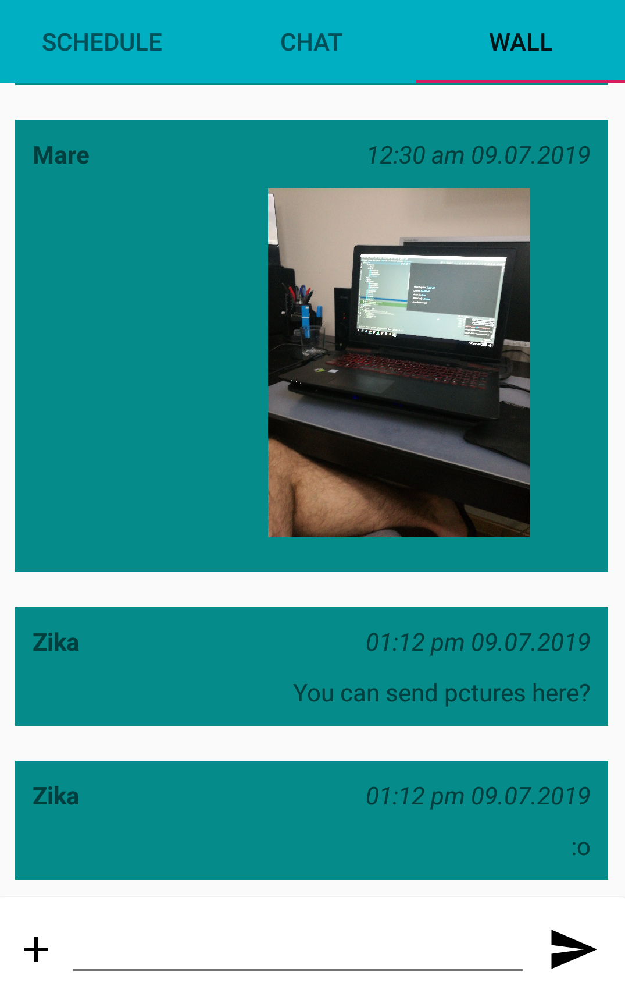

# Raf-student-app
App for students of Racunarski fakultet. It provides up to date schedules directly from site,chat,and group chat for all students.
The app needs improved visual aspect.

## Login screen

Login is not that secure right now,all you need is index number and name to login to your account.
It used firebase authentication for login,but there is some problem with permissions with our accounts.

## Schedule

Schedule is saved at local database,and updated when there is connection with the server.
There are multiple filters and when you click some of the attributes of period it will show you
all periods with that attribute.

## Chat

In this section there will be listed all users currently available.
By clicking on one of them it opens the chat.

## Wall

In this section all users can chat and send pictures.
It is like facebook group where all students can share information.

